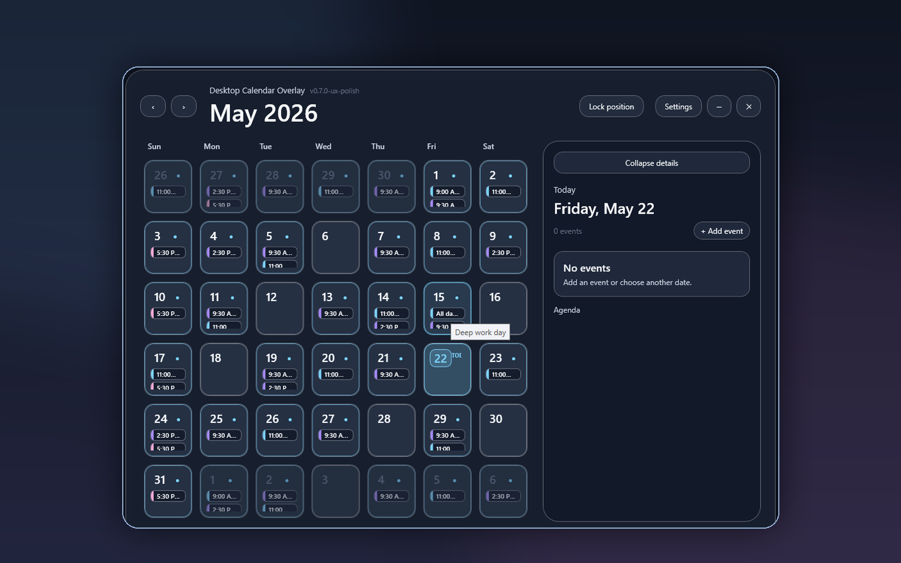

# Desktop Calendar Overlay



**Desktop Calendar Overlay** is a Windows desktop calendar overlay for people who want a large, always-visible, low-distraction Google Calendar view while working. It is built as a .NET 8 WPF app with a Windows 11-style acrylic/minimal productivity direction: borderless overlay shell, compact month grid, collapsible day agenda, tray controls, persisted placement, and a separate settings window for account, display, theme, and layer controls.

This repository is the standalone implementation repo for the Windows app. Planning history and future product ideas remain outside this MVP repo so the codebase stays release-focused.

## Portfolio status

Current release line: **v0.7.1 portfolio-readiness**

| Area | Status |
| --- | --- |
| Windows app MVP | Complete for overlay + Google Calendar CRUD MVP scope |
| Release artifact | `desktop-calendar-overlay-win-x64.zip` only |
| Runtime target | Windows x64, self-contained single-file publish |
| Visual proof | GitHub Actions Windows runner portfolio screenshot committed under `docs/assets/` |
| Credential policy | No OAuth client JSON, tokens, calendar exports, or user data in repo/release assets |

## What it demonstrates

- **Desktop productivity UX:** a persistent, resizable, lockable calendar layer that can sit beside normal work.
- **Windows/WPF execution:** .NET 8 WPF, MVVM-style view models, app/tray lifecycle, persisted window state, app icon metadata, and Windows startup option.
- **Google Calendar integration:** read, create, update, delete path through service interfaces, with safe mock fallback when local OAuth credentials are absent.
- **Release discipline:** Windows CI build/release workflow, single ZIP artifact policy, QA checklist, startup diagnostics, and portfolio screenshot workflow.

## MVP scope

Included in the current MVP:

- .NET 8 + WPF desktop app.
- Borderless/resizable overlay window with persisted position/size and a position-lock toggle.
- Google Calendar read support behind service interfaces.
- Google Calendar create/update/delete path for user-initiated single-event CRUD.
- Separate Settings window for Google authentication, connect/disconnect, and calendar layer selection.
- Mock calendar fallback when no local client JSON/token is available.
- Today date-number badge, display-format setting, opacity slider, event-list text-size slider, layer color palette, and theme selector in Settings.
- Tray menu with Show/Hide, Settings, Refresh, and Exit.
- Windows startup registration option.
- App/window/taskbar icon.

Intentionally out of MVP:

- Repeat events.
- Attendee/invitation workflows.
- Installer/MSIX/auto-update.
- Bundled Google OAuth credentials or user calendar data.

## Prerequisites

Build and visual validation must run on Windows:

- Windows 10/11, with Windows 11 preferred for acrylic/glass visual validation.
- [.NET 8 SDK](https://dotnet.microsoft.com/download/dotnet/8.0).
- Visual Studio 2022 with .NET desktop development workload, or the .NET 8 SDK CLI.

> Development note: WPF targets `net8.0-windows`. macOS/Linux can inspect and version the repo, but release validation should be treated as complete only after Windows GitHub Actions or a Windows machine passes the build/runtime checks.

## Run, logs, and release package

Developer run on Windows:

```powershell
dotnet run --project .\src\DesktopCalendarOverlay\DesktopCalendarOverlay.csproj
```

Diagnostics are written to:

```text
%LOCALAPPDATA%\DesktopCalendarOverlay\logs\startup.log
```

Release packaging uses one ZIP artifact, not an installer/MSIX:

- `desktop-calendar-overlay-win-x64.zip` — self-contained Windows x64 single-file publish output.

Extract the ZIP on Windows and run `DesktopCalendarOverlay.exe`. OAuth credentials/tokens are not bundled; real Google Calendar sync requires the local Desktop OAuth client JSON described below.

## Windows validation

From a Windows terminal at the repository root:

```powershell
.\scripts\windows-validate.ps1
dotnet run --project .\src\DesktopCalendarOverlay\DesktopCalendarOverlay.csproj
```

Manual release checks are tracked in [`docs/QA_CHECKLIST_v0.7.1.md`](docs/QA_CHECKLIST_v0.7.1.md). Summary checks:

1. Window opens without normal OS chrome and remains resizable.
2. Position lock prevents title-drag movement/resizing after placing the overlay.
3. Moving/resizing the window, closing it, and reopening it restores placement.
4. UI remains legible at 100%, 125%, and 150% Windows display scaling.
5. Previous/next month buttons update the displayed calendar month and perform a real refresh.
6. Mock events render inside day cells as small time-ordered list items.
7. Selecting dates and collapsing/expanding the right agenda panel preserves selected-day state; cached date selection avoids unnecessary Google refreshes.
8. Settings opens as a separate dialog containing Google account connect/disconnect controls and calendar layer toggles.
9. Without a local OAuth client JSON/token, mock calendar layers and events render safely.
10. With a valid local OAuth client JSON, Connect opens the Google OAuth browser flow and then loads real calendar layers/events.
11. Add/Edit/Delete single events and verify Google Calendar reflects the changes after refresh.
12. Theme, opacity, text size, display format, layer visibility, and layer colors persist after restart.
13. Tray menu exposes Show/Hide, Settings, Refresh, and Exit; Windows startup can be enabled/disabled from Settings.
14. The app/window/taskbar icon uses the calendar `.ico` asset.
15. The release page attaches exactly `desktop-calendar-overlay-win-x64.zip` for the version tag.

See [`scripts/windows-validate.ps1`](scripts/windows-validate.ps1) for a documented validation helper and [`docs/SPIKE_PLAN.md`](docs/SPIKE_PLAN.md) for the original spike plan.

## Repository layout

```text
src/DesktopCalendarOverlay/   WPF app project and MVVM implementation
docs/                         Architecture, QA, OAuth/security, and portfolio assets
scripts/                      Windows-side validation helper
.github/workflows/            Windows release and portfolio screenshot workflows
```

## Security notes

Do not commit OAuth client secrets, refresh tokens, exported credential files, or Google Cloud project configuration. For local testing, place the Desktop OAuth client JSON at `%LOCALAPPDATA%\DesktopCalendarOverlay\google-oauth-client.json`; the app stores tokens under `%LOCALAPPDATA%\DesktopCalendarOverlay\google-token-store`. See [`docs/OAUTH_AND_SECURITY.md`](docs/OAUTH_AND_SECURITY.md).

## Known limitations

- WPF visual/runtime validation is Windows-only.
- Real Google sync requires a local Google OAuth Desktop app JSON and permitted test user/consent setup.
- Repeat events and attendee/invitation workflows are intentionally out of MVP scope.
- Packaging is a single self-contained win-x64 ZIP; no separate portable-folder ZIP, installer, MSIX, or auto-update is included yet.
